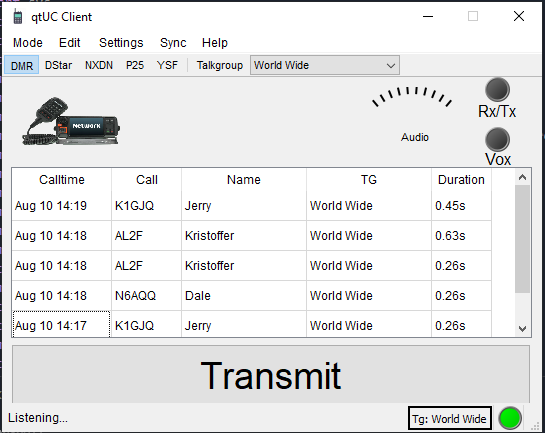
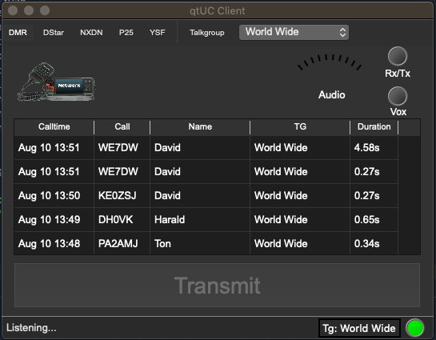

[![Last Commit][last-commit-shield]][last-commit-url]
[![Issues][issues-shield]][issues-url]
 
[![Contributors][contributors-shield]][contributors-url]
[![Forks][forks-shield]][forks-url]
[![Stargazers][stars-shield]][stars-url]

<!-- PROJECT LOGO -->
 

  

  <h1 align="center">qtUC (USRP Client)</h1>

  

    qtUC is a GUI application for accessing amateur radio digital networks from your PC
     
    <a href="https://github.com/greythane/qtUC/wiki"><strong>Explore the docs »</strong></a>
     
     
    <!--  <a href="https://github.com/greythane/qtUC">View Demo</a>
    ·  -->
    <a href="https://github.com/greythane/qtUC/issues">Report Bug</a>
    ·
    <a href="https://github.com/greythane/qtUC/issues">Request Feature</a>
  

<!-- TABLE OF CONTENTS -->

  
<h2 style="display: inline-block">Table of Contents</h2>

  <ul>
    <li>
      <a href="#introduction">About qtUC</a>
      <ul>
        <li><a href="#built-with">Built With</a></li>
        <li><a href="#features">Features</a></li>
        <li><a href="#Downloads">Downloads</a></li>
      </ul>
    </li>
    <li>
      <a href="#getting-started">Getting Started</a>
      <ul>
        <li><a href="#prerequisites">Prerequisites</a></li>
        <li><a href="#installation">Installation</a></li>
      </ul>
    </li>
    <li><a href="#usage">Usage</a></li>
    <li><a href="#roadmap">Roadmap</a></li>
    <li><a href="#contributing">Contributing</a></li>
    <li><a href="#contact">Contact</a></li>
    <li><a href="#license">License</a></li>
  </ul>

<!-- ABOUT THE PROJECT -->
## Introduction
qtUC provides a user friendly front end application for the DVSwitch suite of software and connects to the Analog_Bridge component to provide access to the amateur radio DMR, DStart, Fusion, YSF and P25 digital networks using a PC    
The underlying code is built on the original pyUC application by N4IRR but with a QT5 interface, using multiple threads for the usrp and audio communications  
It was originally implemented as a means to investigate creating a GUI for pyUC and to learn and understand the communication methods used in the DVSwitch application   

	

		
		<h3>Windows 10</h3>
	

	

		
		<h3>OSX Mojave</h3>
	

## Built with
- Python
- PyQt5
- PyAudio

## Features
 - Select digital network
 - Select "talk group" or reflector from a list
 - Transmit and receive to the network
 - Record a list of stations received in the session
 - See pictures of the hams from QRZ.com  
 - Themeable
 - much more...
 
[Back To Top][top]

## Downloads
Packaged versions are available from the [releases] page

[Back To Top][top]

## Getting started
### Prerequisites
To transmit, a valid amateur licence for your country and a DMR ID is required  
Go to [RadioID][radioid-url] to register and obtain a DMR ID if you do not have one  
qtUC will run in receive only mode without a DMR ID

### Installation
Download the current release for your OS from [releases]  
Currently all releases are x64 bit.  If an x32 bit installation is required please see the build instructions  

- Windows  
	Extract to your choice of directory  
   Run qtUC and modify settings to suit your system
     
- Linux  
    Run qtUC and modify settings to suit your system

- Mac  
    Run qtUC and modify settings to suit your system

- Source  
	If you wish to build and run from source, see the [build][buildme] instructions for requirements  

[Back To Top][top]

<!-- USAGE EXAMPLES -->
## Usage

qtUC is for use by licenced amateur radio operators on the amateur networks.  
Commercial or other use is strictly prohibited

<!-- ROADMAP -->
## Roadmap
Suggestion or feature requests are alway welcome  
See the [open issues][issues-url] for a list of proposed features (and known issues).

[Back To Top][top]

<!-- CONTRIBUTING -->
## Contributing
Contributions are what make the open source community such an amazing place to be learn, inspire, and create. Any contributions you make are **greatly appreciated**.

1. Fork the Project
2. Create your Feature Branch (`git checkout -b feature/AmazingFeature`)
3. Commit your Changes (`git commit -m 'Add some AmazingFeature'`)
4. Push to the Branch (`git push origin feature/AmazingFeature`)
5. Open a Pull Request

<!-- CONTACT -->
## Contact

VK3VW (Rowan) - [Github](https://github.com/greythane) | [Email](mailto:greythane@gmail.com)

Project Link: [https://github.com/greythane/qtUC](https://github.com/greythane/qtUC)

## Related projects
[DVSwitch](https://dvswitch.groups.io), [USRP_Client (pyUC)] (https://github.com/DVSwitch/USRP_Client)

[Back To Top][top]

## License
This software is for use on amateur radio networks only, it is to be used  
for educational purposes only. Its use on commercial networks is strictly   
prohibited.  Permission to use, copy, modify, and/or distribute this software   
hereby granted, provided that the above copyright notice and this permission   
notice appear in all copies.  

THE SOFTWARE IS PROVIDED "AS IS" AND DVSWITCH DISCLAIMS ALL WARRANTIES WITH  
REGARD TO THIS SOFTWARE INCLUDING ALL IMPLIED WARRANTIES OF MERCHANTABILITY  
AND FITNESS.  IN NO EVENT SHALL N4IRR BE LIABLE FOR ANY SPECIAL, DIRECT,  
INDIRECT, OR CONSEQUENTIAL DAMAGES OR ANY DAMAGES WHATSOEVER RESULTING FROM  
LOSS OF USE, DATA OR PROFITS, WHETHER IN AN ACTION OF CONTRACT, NEGLIGENCE  
OR OTHER TORTIOUS ACTION, ARISING OUT OF OR IN CONNECTION WITH THE USE OR  
PERFORMANCE OF THIS SOFTWARE.  

[Back To Top][top]

<!-- MARKDOWN LINKS & IMAGES -->
<!-- https://www.markdownguide.org/basic-syntax/#reference-style-links -->
[top]: #top
[releases]: https://github.com/greythane/qtUC/releases
[pull-requests]: https://github.com/greythane/qtUC/pulls
[chat]: https://github.com/greythane/qtUC/discussions
[wiki]: https://github.com/greythane/qtUC/wiki
[buildme]: https://github.com/greythane/qtUC/build.md
[wiki]: https://github.com/greythane/qtUC/wiki
[last-commit-shield]: https://img.shields.io/github/last-commit/greythane/qtUC?style=for-the-badge
[last-commit-url]: https://github.com/greythane/qtUC/commits/master
[contributors-shield]: https://img.shields.io/github/contributors/greythane/qtUC?style=for-the-badge
[contributors-url]: https://github.com/greythane/repo/graphs/contributors
[forks-shield]: https://img.shields.io/github/forks/greythane/qtUC?style=for-the-badge
[forks-url]: https://github.com/greythane/repo/network/members
[stars-shield]: https://img.shields.io/github/stars/greythane/qtUC?style=for-the-badge
[stars-url]: https://github.com/greythane/qtUC/stargazers
[issues-shield]: https://img.shields.io/github/issues/greythane/qtUC?style=for-the-badge
[issues-url]: https://github.com/greythane/qtUC/issues
[radioid-url]: https:/radioid.net